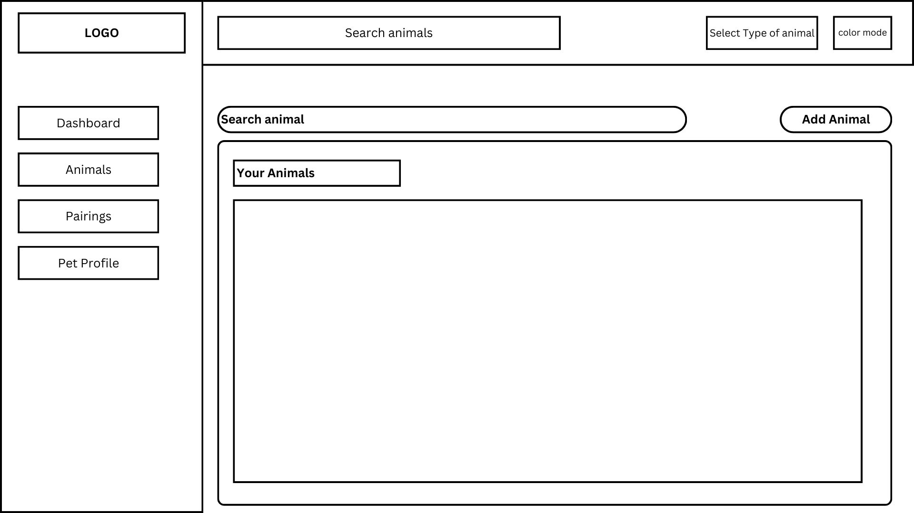
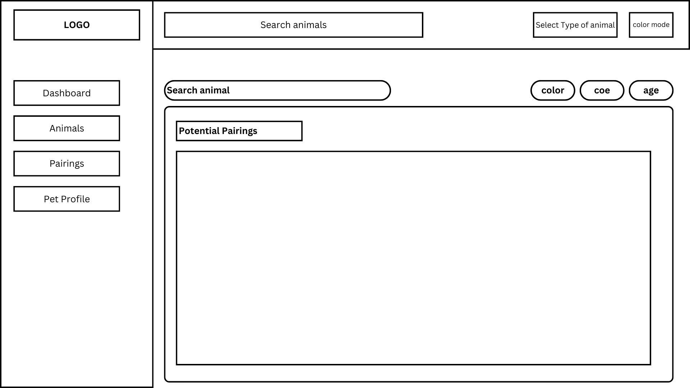
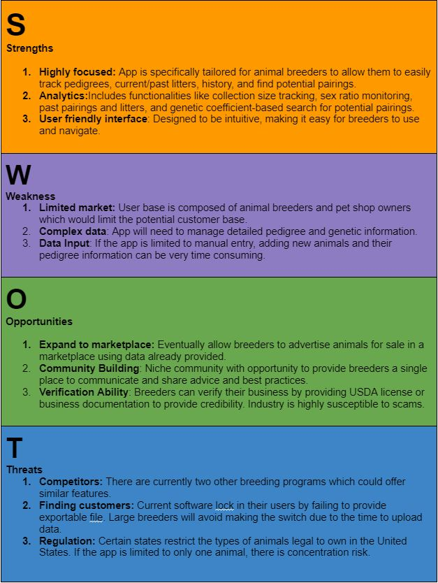
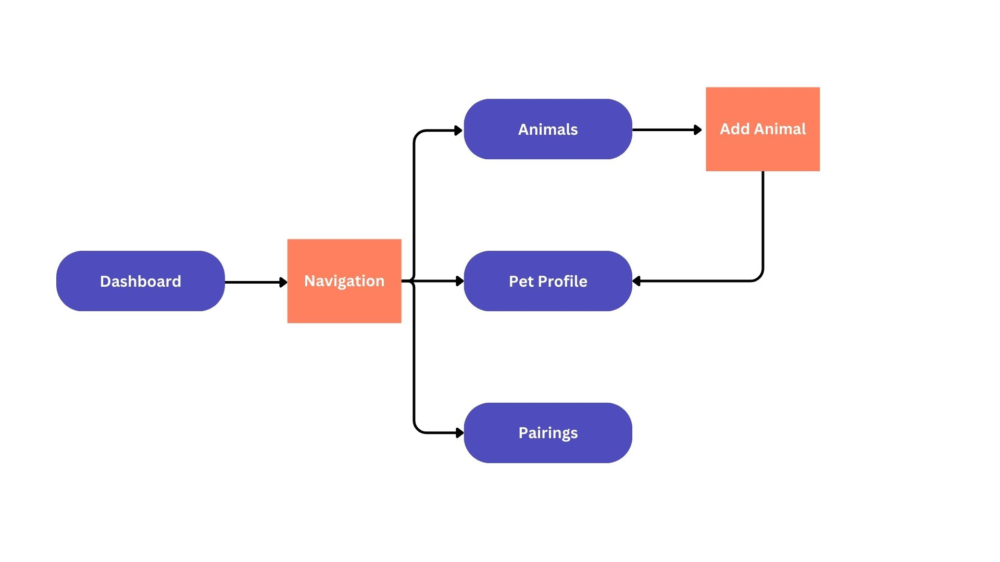

# ImperiumPets Documentation

## Definition Statement

I want to build an application that allows animal breeders to track the health of their animals and find potential pairings.

## Audience

Breeders, pet owners, and pet store owners.

## Application Outline

### Purpose

To simplify the process of tracking animals and finding appropriate pairings with low genetic coefficients.

### Problem Solving

There isn't an easy way for animal breeders, keepers, and pet store owners to track their current animals. This also leads to animal inbreeding and poor health outcomes for the animals.

### Dashboard

-Table showing list of animals
-Table with current pairings
-Navigation

### Animals

-Table of animals owned by breeder
-Button to add additional animals
-Import animals from csv file (if time allows)

### Pairings

-Table of potential pairings
-Input for animal name
-Table provides filters to narrow search by color, age, coefficient (if time allows)

### Pet Profile

-Picture of animal
-Table of information about the animal (name, dob, gender)
-Table of past pairings
-Table of potential pairings

## Application Attributes

### Color Palette

1. Light Mode
 -Background(#FCFAFD)
 -Card(#FBFBFB)
 -Text(#171E2A)
 -Brand(#06AF74)

2. Dark Mode
 -Background(#16171B)
 -Card(#212226)
 -Text(#DFE1E4)
 -Brand(#06AF74)

### Images

-favicon
-logo (dark/light mode)

### Fonts

  -body: poppins, system-ui, sans-serif,
  -heading: poppins, Helvetica, sans-seriff

### Navigation

Navigation will be easily accessibly using a left-hand side bar. Break points will hide sidebar until opened by user using hamburger icon in top navbar. Top navbar will also include a search input to access database and route user to pet profile for animal searched.

-Dashboard
-Animals
-Pairings
-Pet Profile

## Research

1. [Pedigree Database Online](pedigreedatabaseonline.com)
  -**Features**:
    -Pairings table
    -Animal profile with unorganized list of all past litters and pairings.
    -No ability to import from csv file requiring users to input all information manually.
  -**Missing/Additions**:
    -Outdated UI/UX. The platform is not intuitive and difficult to navigate. Does provide the ability to search for potential pairings based on animals genetic coefficient. Only available for hedgehogs and tenrecs.
    -Improve UI allowing for navigation from any page. Incorporate simple search in navbar to search for any animal.

## SWOT Analysis

## User Flow Diagram

